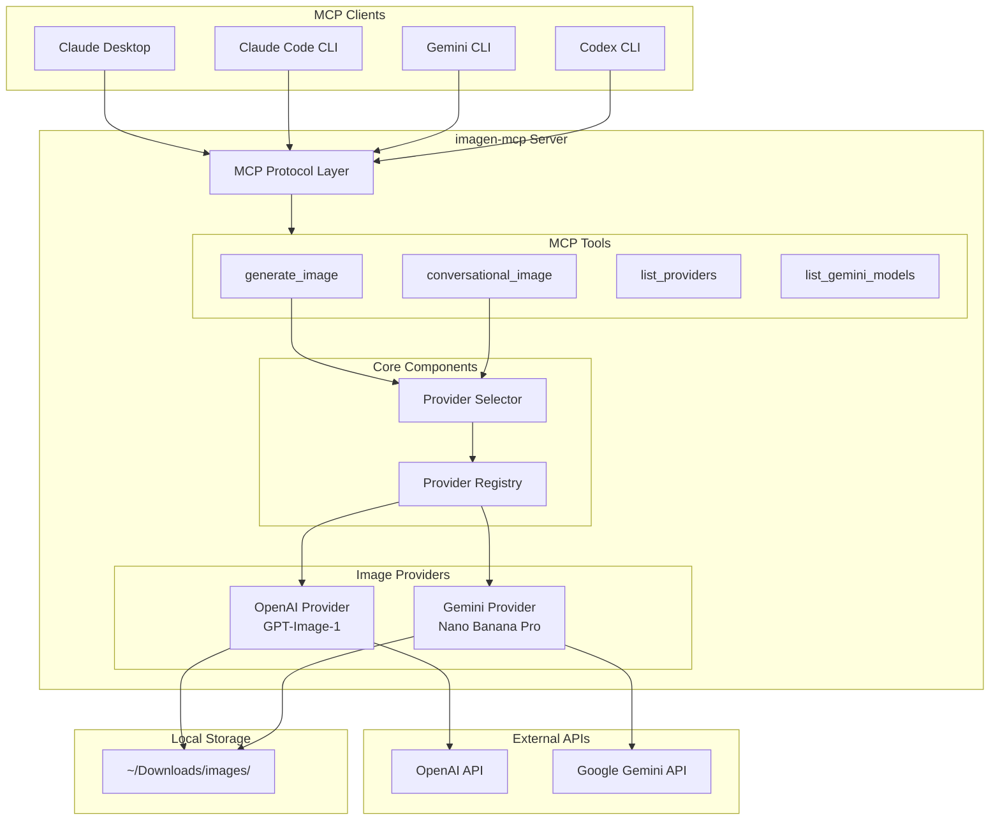

# imagen-mcp

A Model Context Protocol (MCP) server for intelligent multi-provider image generation.

[](https://github.com/michaeljabbour/imagen-mcp/actions/workflows/ci.yml)
[](https://www.python.org/downloads/)
[](https://opensource.org/licenses/MIT)

## Quick Start

**1. Get an API key** (at least one):

| Provider | Get a key at | Environment variable |
|----------|-------------|---------------------|
| OpenAI | [platform.openai.com/api-keys](https://platform.openai.com/api-keys) | `OPENAI_API_KEY` |
| Google Gemini | [aistudio.google.com/apikey](https://aistudio.google.com/apikey) | `GEMINI_API_KEY` |

> Having **both** keys gives you the best results — the server automatically picks the right provider for each prompt. With only one key, prompts better suited for the other provider will still work, but you'll see a fallback notice.

**2. Add to your MCP client** (pick one):

<details>
<summary><strong>Claude Code</strong></summary>

```bash
claude mcp add -s user imagen \
  -e OPENAI_API_KEY=sk-... \
  -e GEMINI_API_KEY=AI... \
  -- npx -y imagen-mcp
```

Verify it's registered:

```bash
claude mcp list
```

Reference: [Claude Code MCP docs](https://code.claude.com/docs/en/mcp)

</details>

<details>
<summary><strong>Claude Desktop</strong></summary>

Edit the config file:
- **macOS:** `~/Library/Application Support/Claude/claude_desktop_config.json`
- **Windows:** `%APPDATA%\Claude\claude_desktop_config.json`

```json
{
  "mcpServers": {
    "imagen": {
      "command": "npx",
      "args": ["-y", "imagen-mcp"],
      "env": {
        "OPENAI_API_KEY": "sk-...",
        "GEMINI_API_KEY": "AI..."
      }
    }
  }
}
```

Restart Claude Desktop (Cmd+Q, then reopen) after editing.

Reference: [Claude Desktop MCP docs](https://modelcontextprotocol.io/quickstart/user)

</details>

<details>
<summary><strong>Codex CLI</strong></summary>

Option A — CLI command:

```bash
codex mcp add imagen -- npx -y imagen-mcp
```

Option B — edit `~/.codex/config.toml` directly:

```toml
[mcp_servers.imagen]
command = "npx"
args = ["-y", "imagen-mcp"]

[mcp_servers.imagen.env]
OPENAI_API_KEY = "sk-..."
GEMINI_API_KEY = "AI..."
```

Reference: [Codex MCP docs](https://developers.openai.com/codex/mcp/)

</details>

<details>
<summary><strong>Gemini CLI</strong></summary>

Edit `~/.gemini/settings.json`:

```json
{
  "mcpServers": {
    "imagen": {
      "command": "npx",
      "args": ["-y", "imagen-mcp"],
      "env": {
        "OPENAI_API_KEY": "sk-...",
        "GEMINI_API_KEY": "AI..."
      }
    }
  }
}
```

Reference: [Gemini CLI MCP docs](https://geminicli.com/docs/tools/mcp-server/)

</details>

<details>
<summary><strong>Any other MCP client</strong></summary>

| Setting | Value |
|---------|-------|
| Command | `npx` |
| Args | `["-y", "imagen-mcp"]` |
| Environment | `OPENAI_API_KEY` and/or `GEMINI_API_KEY` |

</details>

**3. Generate an image** — ask your AI assistant:

> "Generate a professional headshot with studio lighting"

That's it. The server picks the best provider automatically.

---

## Features

- **Auto Provider Selection** — analyzes prompts to choose the best provider
- **Multi-Provider Support** — OpenAI GPT-Image-1 and Google Gemini
- **Reference Images** — up to 14 images for character/style consistency (Gemini)
- **Real-time Data** — Google Search grounding for current info (Gemini)
- **Conversational Refinement** — iteratively refine images with context
- **High Resolution** — up to 4K output (Gemini)
- **Fallback Notices** — clear warnings when a prompt would benefit from a provider you haven't configured

## How Auto-Selection Works

The server analyzes your prompt and routes it to the best provider:

```
"Create a menu card for an Italian restaurant"  -> OpenAI (text rendering)
"Professional headshot with studio lighting"    -> Gemini (photorealism)
"Infographic about climate change"              -> OpenAI (diagram + text)
"Product shot of perfume on marble"             -> Gemini (product photography)
```

**What if the best provider isn't configured?** The server falls back to whatever you have and tells you:

> **Provider Fallback:** Gemini would be better for this prompt (Photorealistic content), but it's not configured. Using OpenAI instead. Set `GEMINI_API_KEY` for better results.

You can always override auto-selection with the `provider` parameter:

```
generate_image(prompt="...", provider="openai")
generate_image(prompt="...", provider="gemini")
```

## Provider Comparison

| Feature | OpenAI GPT-Image-1 | Gemini Nano Banana Pro |
|---------|-------------------|------------------------|
| Text Rendering | Excellent | Good |
| Photorealism | Good | Excellent |
| Speed | ~60s | ~15s |
| Max Resolution | 1536x1024 | 4K |
| Sizes | 3 options | 1K, 2K, 4K |
| Aspect Ratios | 3 | 10 |
| Reference Images | No | Yes (up to 14) |
| Real-time Data | No | Yes (Google Search) |

**Use OpenAI for:** text-heavy images, menus, infographics, comics, diagrams

**Use Gemini for:** portraits, product photography, 4K output, reference images

## MCP Tools

| Tool | Description |
|------|-------------|
| `generate_image` | Main tool with auto provider selection |
| `conversational_image` | Multi-turn refinement with dialogue and history |
| `list_conversations` | List active conversations and their history |
| `list_providers` | Show available providers and capabilities |
| `list_gemini_models` | Query available Gemini image models |

## Output Location

Images are saved to `~/Downloads/images/{provider}/` by default (`openai/` or `gemini/` subdirectories).

Customize with:

```
# Save to a specific directory (auto-generated filename)
generate_image(prompt="...", output_path="~/Desktop/logos/")

# Save to a specific file
generate_image(prompt="...", output_path="~/Desktop/logos/my-logo.png")
```

Set `OUTPUT_DIR` to change the base directory globally. Logs go to `{OUTPUT_DIR}/logs/`.

## Gemini-Specific Features

```
# High resolution
generate_image(prompt="...", size="4K")

# Specific model
generate_image(prompt="...", gemini_model="gemini-2.0-flash-exp-image-generation")

# Reference images for style/character consistency (base64 encoded)
generate_image(prompt="...", reference_images=["base64..."])

# Real-time data via Google Search
generate_image(prompt="Current weather in NYC", enable_google_search=True)
```

## Available Models

### OpenAI

| Model ID | Description |
|----------|-------------|
| `gpt-image-1` | Dedicated image generation model (default) |
| `gpt-5-image` | GPT-5 with image generation capabilities |
| `gpt-5.1` | Latest reasoning model (conversation orchestration) |

### Gemini

| Model ID | Description |
|----------|-------------|
| `gemini-3-pro-image-preview` | Nano Banana Pro - highest quality (default) |
| `gemini-2.0-flash-exp-image-generation` | Fast experimental |
| `imagen-3.0-generate-002` | Alternative image model |

## Architecture



## Environment Variables

| Variable | Description | Required |
|----------|-------------|----------|
| `OPENAI_API_KEY` | OpenAI API key | At least one API key |
| `GEMINI_API_KEY` | Google Gemini API key | is required |
| `GOOGLE_API_KEY` | Alias for `GEMINI_API_KEY` | |
| `OUTPUT_DIR` | Base directory for saved images | No (default: `~/Downloads/images/`) |
| `DEFAULT_PROVIDER` | Force a default provider | No (default: `auto`) |
| `DEFAULT_OPENAI_SIZE` | Default OpenAI image size | No (default: `1024x1024`) |
| `DEFAULT_GEMINI_SIZE` | Default Gemini image size | No (default: `2K`) |
| `ENABLE_GOOGLE_SEARCH` | Enable Google Search grounding | No (default: `false`) |
| `IMAGEN_MCP_LOG_DIR` | Log directory override | No |
| `IMAGEN_MCP_LOG_LEVEL` | Log level (DEBUG, INFO, etc.) | No |
| `IMAGEN_MCP_LOG_PROMPTS` | Log full prompts | No (default: `false`) |

## Troubleshooting

**"No providers available"**
You need at least one API key. Set `OPENAI_API_KEY` or `GEMINI_API_KEY` in your MCP client config (see Quick Start above).

**Images generate but quality isn't great for portraits/products**
You're probably missing `GEMINI_API_KEY`. The server fell back to OpenAI and showed a warning. Add a Gemini key for better photorealistic results.

**Images generate but text looks bad**
You're probably missing `OPENAI_API_KEY`. Add an OpenAI key for better text rendering.

**"npx: command not found"**
Install Node.js (which includes npx): [nodejs.org](https://nodejs.org/)

**Where are my images saved?**
Default: `~/Downloads/images/openai/` or `~/Downloads/images/gemini/`. Check the tool output for the exact path. Set `OUTPUT_DIR` to change this.

**How do I check which providers are active?**
Use the `list_providers` tool, or run:
```bash
python3 -c "from src.providers import get_provider_registry; print(get_provider_registry().list_providers())"
```

## Development

```bash
# Clone and install
git clone https://github.com/michaeljabbour/imagen-mcp.git
cd imagen-mcp
pip install -r requirements.txt

# Run tests
pip install pytest pytest-asyncio
pytest tests/ -v

# Verify server loads
python3 -c "from src.server import mcp; print('Server loads')"

# Check Claude Desktop logs (macOS)
tail -f ~/Library/Logs/Claude/mcp-server-imagen.log
```

## Project Structure

```
imagen-mcp/
├── src/
│   ├── server.py              # MCP entry point
│   ├── config/
│   │   ├── constants.py       # Provider constants
│   │   └── settings.py        # Environment configuration
│   ├── providers/
│   │   ├── base.py            # Abstract provider interface
│   │   ├── openai_provider.py # OpenAI implementation
│   │   ├── gemini_provider.py # Gemini implementation
│   │   ├── selector.py        # Auto-selection logic
│   │   └── registry.py        # Provider factory
│   └── models/
│       └── input_models.py    # Pydantic input models
├── tests/
│   ├── test_selector.py       # Provider selection tests
│   ├── test_providers.py      # Provider unit tests
│   └── test_server.py         # Server integration tests
├── .github/
│   └── workflows/
│       └── ci.yml             # GitHub Actions CI
├── run.sh                     # Wrapper script for MCP clients
├── requirements.txt
├── CLAUDE.md
└── README.md
```

## Requirements

```
mcp>=1.16.0
fastmcp>=2.12.5
pydantic>=2.12.3
httpx>=0.24.0
google-genai>=1.52.0
pillow>=10.4.0
```

## License

MIT

## Sources

- [Claude Code MCP Documentation](https://code.claude.com/docs/en/mcp)
- [Gemini CLI MCP Documentation](https://geminicli.com/docs/tools/mcp-server/)
- [Codex MCP Documentation](https://developers.openai.com/codex/mcp/)
- [Model Context Protocol](https://modelcontextprotocol.io/)
